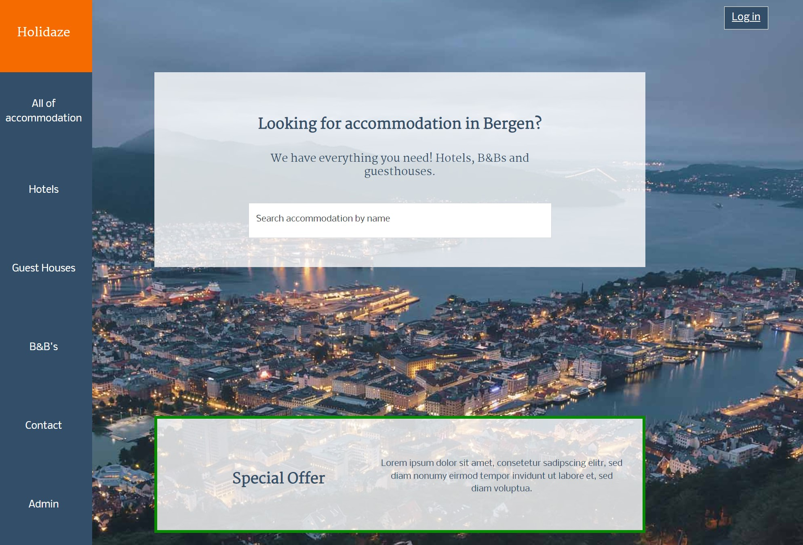

# Holidaze - Projext exam 2

- Accommodation booking site
- School project

## Description

- Booking site with list of accommodations divided in categories :

                                                                 1) Hotels

                                                                 2) Guest Houses
                                                                 
                                                                 3) B&B's
    
- Specif accommodation page with details.

- Working enquiry page, search bar, login form, contact form.

- Admin page where is possible to create new establishment, see all enquiries and messages.

### Style tile and prototype design done in Adobe xd done.

:globe_with_meridians: Style tile link - https://xd.adobe.com/view/544431cf-13c7-4bf4-b8f7-4a93bef3d9d0-0117/

:globe_with_meridians: Prototype link - https://xd.adobe.com/view/4a94ff38-1f54-4403-a9b0-a115cd7ee9f5-1fc7/

### Planned with Trello board

:globe_with_meridians: Trello board - https://trello.com/b/IeK8ygNY/project-exam-2


:globe_with_meridians: Live link - https://holidaze-accommodation.netlify.app

## Screenshots

### Admin page
<div align="center"> 
  
  
  
  
</div>

## Built With


- [React.js](https://reactjs.org/)
- [Bootstrap](https://getbootstrap.com)
- [Sass](https://sass-lang.com)
- [Wordpress (as API)](https://developer.wordpress.org/rest-api/)

## Getting Started

### Installing


1. Clone the repo:

```bash
git clone git@github.com:Bockey/holidaze.git
```

2. Install the dependencies:

```
npm install
```

### Running

To run the app, run the following commands:

```bash
npm run start
```


## Contact

This is where you can leave your social links for people to contact you, such as a LinkedIn profile or Twitter link e.g.

[My portfolio page](https://bockey.one/)

[My LinkedIn page](https://www.linkedin.com/in/boris-gudelj-a535091b4/)


