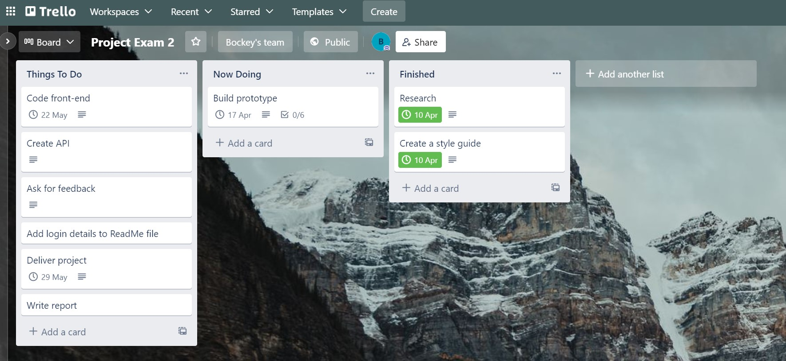
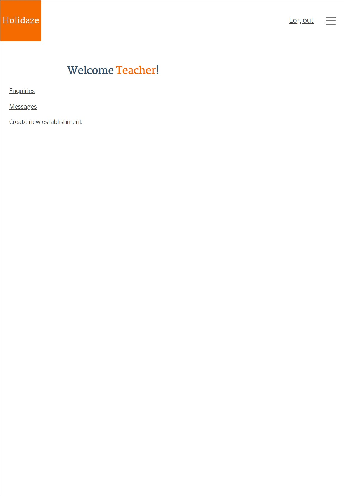
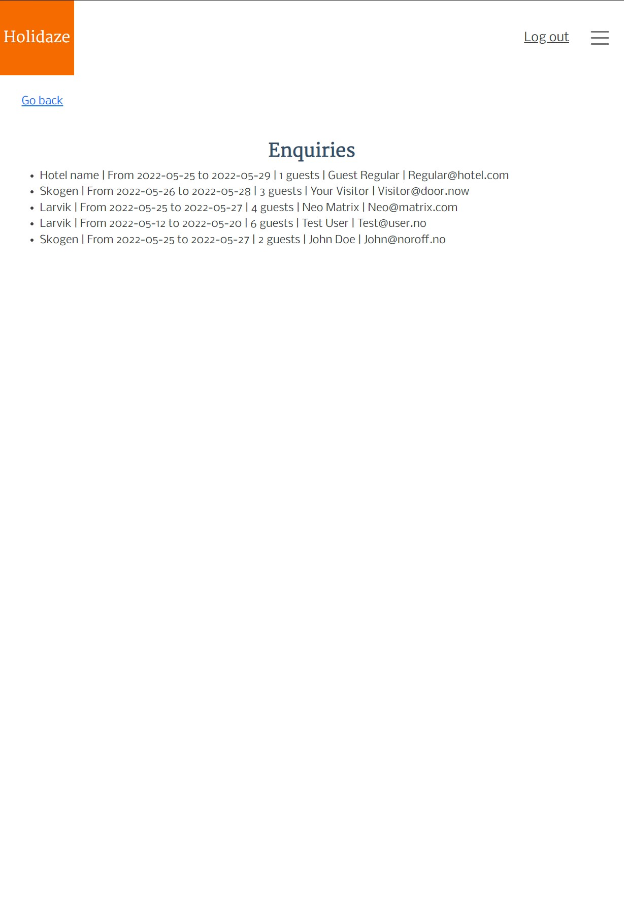
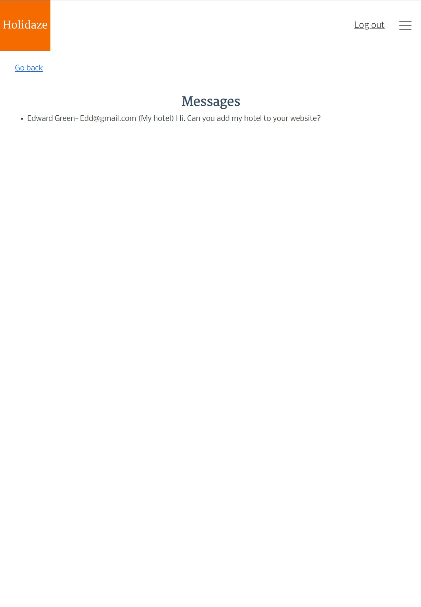
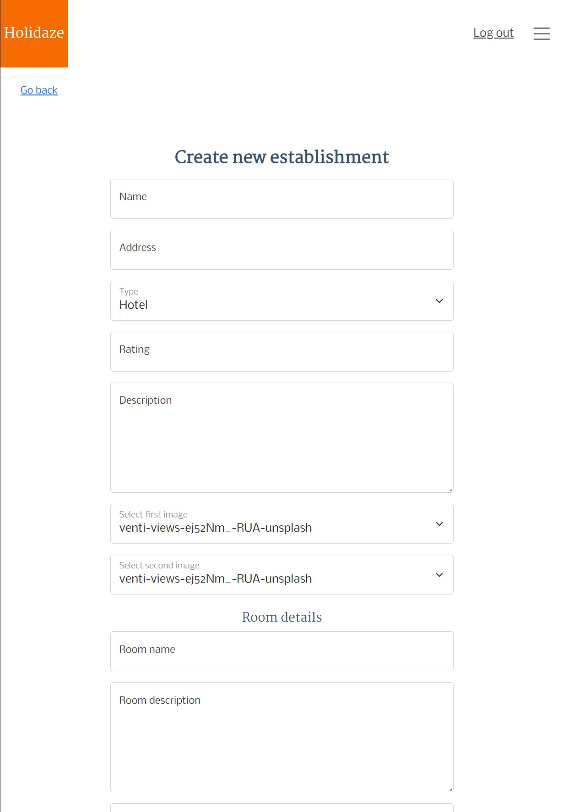

# Final exam project

Holidaze - hotel booking site builder with react/bootstrap/sass.

## For api used WordPress.

## Style tile and prototype design done in Adobe xd done.

### Style tile link - https://xd.adobe.com/view/544431cf-13c7-4bf4-b8f7-4a93bef3d9d0-0117/

### Prototype link - https://xd.adobe.com/view/4a94ff38-1f54-4403-a9b0-a115cd7ee9f5-1fc7/

## Project planned with help of Trello board.

## Login details

Username: teacher
Password: noroff123

### Admin page

## Live link - https://holidaze-accommodation.netlify.app
